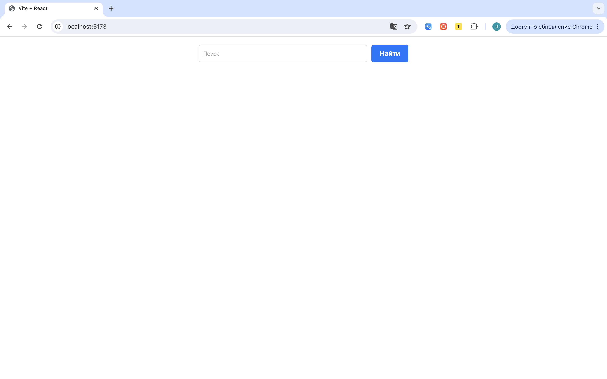
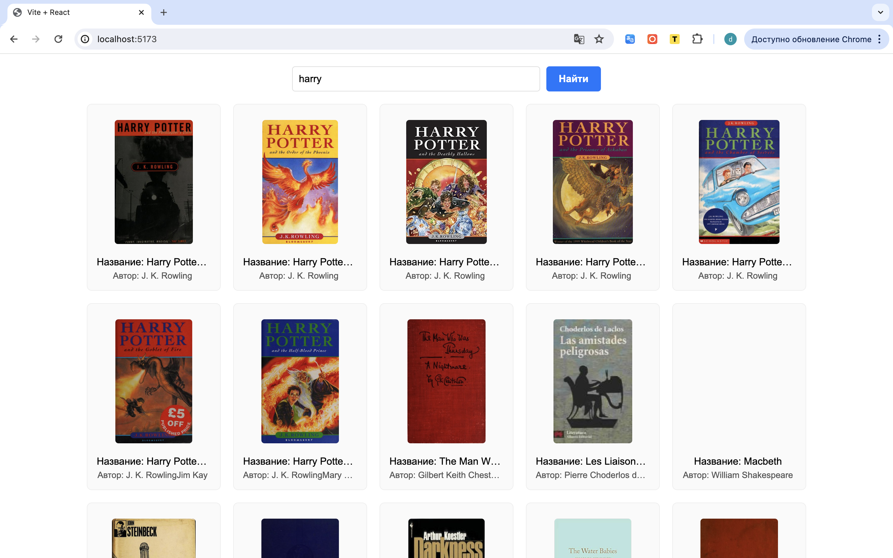
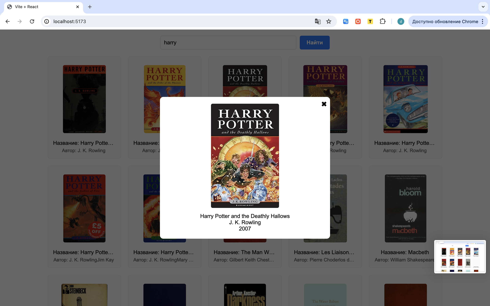

# 📚 Library App

Приложение на React, которое позволяет искать книги по названию и просматривать их подробности.  
Использует [Open Library API](https://openlibrary.org/developers/api) для получения данных.

---

## 🚀 Возможности
- 🔍 Поиск книг по названию
- 📋 Отображение списка найденных книг
- 🖼️ Обложка книги
- 📝 Детальная информация (автор, год первой публикации и т. д.)
- 🪟 Модальное окно с подробной информацией
- 🎨 Стилизация через CSS-модули

---

## 🛠️ Используемые технологии
- [React]
- [Vite]
- CSS Modules
- [Open Library API](https://openlibrary.org/developers/api)

---

## 📸 Скриншоты

### Поиск книг

### Список книг

### Детали книги

---
